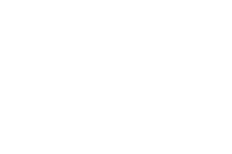

# VIVARIUM
Grupo 3 // Proyecto 5 femcoders.



## Tabla de Contenidos
1. [Información General](#información-general)
2. [Teconologías](#tecnologías)
3. [Instalación](#instalación)
4. [Autores](#autores)
5. [FAQs](#faqs)

***
## Información General
Vivarium es una página dónde poder apadrinar especies marinas que se encuentran en peligro, en este caso posidonias y gorgonias del mar mediterráno.

Para poder apadrinar se facilita un formulario en el que, después de ver la galeria de especies que están disponibles, se introducen los datos del nombre, mail, especie elegida y la cantidad que se desea invertir.

*Proyecto en proceso de desarrollo.*

***

## Tecnologías
Lista de tecnologías usadas en el desarrollo del proyecto:
* HTML: Version HTML 5
* JavaScript
* React
* CSS

1. Ingresar en Visual Studio Code
2.  Clonar el proyecto con el comando:
 ```
git clone 
```
En ordenador instalar:
3. Instalar [Node js](https://nodejs.org/es/download/)
4. En la terminarl del Visual Studio Code, escribirel comando:
```
npm i
```
5. Instalar el resto de paquetes

Cookies: npm install react-cookie
Maps: npm install axios
Captcha: npm install --save react-google-recaptcha
Scroll: npm install react-scroll


***
## Autores
[Alicia Gárgoles]
[Celia Millán]
[Ana Gabriela]
[Oliris]
[Florangel]
[Emily Mosquera]
[Roxana]


***
## FAQs

Preguntas frecuentes:
1. **¿Tengo problemas con React, no me deja ejecutar la página?**
Mirar si está en el *explorador de archivos*, la carpeta *"node_modules"*. En caso de no estar, ir a la *terminal* y ejecutar el comando
 ```
npm i
```

